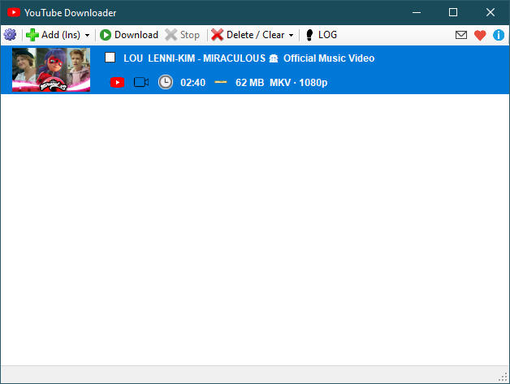

# 🏳️‍🌈 Happy LGBT Pride Month 🎉

# 🏳️‍🌈 Social networks crawler 🏳️‍🌈

:eu:
:greece:

A program to download photo and video from [any site](#supported-sites) (e.g. YouTube, YouTube Music, OnlyFans, Reddit, Twitter, Mastodon, Instagram, Threads, Facebook, TikTok, RedGifs, JustForFans, PornHub, XHamster, XVIDEOS, ThisVid, LPSG, Pinterest).

**If you like SCrawler, please like the program on [this site](https://alternativeto.net/software/scrawler/about/) and/or [this](https://www.softpedia.com/get/Internet/Download-Managers/Social-networks-crawler.shtml)**

**Join our Discord server**: https://discord.gg/uFNUXvFFmg
 *If you have problems using the program, you can get help faster on our Discord server!*

<!---Do you like this program? Consider adding to my coffee fund by making a donation to show your support. :blush:
--->
**Bitcoin**: BC1Q0NH839FT5TA44DD7L7RLR97XDQAG9V8D6N7XET

[**YouTube standalone application:**](https://github.com/AAndyProgram/SCrawler/wiki/YouTube-downloader)

# What can program do:
- Download pictures and videos from user profiles:
  - YouTube videos, shorts, community feeds, users, artists, playlists, music, tracks;
  - Reddit images, galleries of images, videos, saved posts;
  - Redgifs images and videos (https://www.redgifs.com/);
  - Twitter images and videos, saved (bookmarked) posts, likes, communities;
  - Bluesky images and videos;
  - OnlyFans images and videos, saved (bookmarked) posts, stories;
  - JustForFans images and videos, saved (bookmarked) posts;
  - Mastodon images and videos, saved (bookmarked) posts;
  - Instagram images and videos, tagged posts, stories, saved posts;
  - Threads images and videos, saved posts;
  - Facebook images and videos, stories, saved posts;
  - TikTok images and videos;
  - Pinterest boards, users, saved posts;
  - Imgur images, galleries and videos;
  - Gfycat videos;
  - PornHub images, videos, save (liked) posts, search queries, search categories;
  - XHamster images, videos, saved posts, search queries, search categories, search tags;
  - XVIDEOS videos, saved posts, search queries, search categories;
  - ThisVid images, videos, saved posts, search queries, search categories, search tags;
  - [Other](#supported-sites) supported sites
- Parse [Reddit channel and view data](https://github.com/AAndyProgram/SCrawler/wiki/Channels)
- Download [saved posts](https://github.com/AAndyProgram/SCrawler/wiki/Home#saved-posts)
- Add users from parsed channel
- **Advanced user management**
- **Automation** ([downloading data automatically](https://github.com/AAndyProgram/SCrawler/wiki/Settings#automation) every `X` minutes)
- **Feed** ([feed](https://github.com/AAndyProgram/SCrawler/wiki#feed) of downloaded media files and subscriptions posts)
- Multiple accounts support
- Labeling users
- Create [download groups](https://github.com/AAndyProgram/SCrawler/wiki/Settings#download-groups)
- Adding users to favorites and temporary
- Adding users and search queries in the **Subscription** mode (download post preview, but do not download the media file)
- [Filter exists users](https://github.com/AAndyProgram/SCrawler/wiki#view) by label or group
- Selection of media types you want to download (images only, videos only, both)
- [Download a special video](https://github.com/AAndyProgram/SCrawler/wiki#download-separate-video), image or gallery
- Making [collections](https://github.com/AAndyProgram/SCrawler/wiki#collections) (grouping users into collections)
- Specifying a user folder (for downloading data to another location)
- Changing user icons
- Changing [view modes](https://github.com/AAndyProgram/SCrawler/wiki#view)
- ...and many others...

# Supported sites
- **YouTube**
- **YouTube Music**
- **Reddit**
- **Twitter**
- **Bluesky**
- **OnlyFans** *(partial support)*[^1]
- **Instagram**
- **Threads**
- **Facebook**
- JustForFans *(partial support) ([video issue](https://discord.com/channels/1124032649682493462/1205547615199039551/1231349555132366870))*[^1]
- Mastodon *(out of support)*
- TikTok
- RedGifs
- Pinterest
- Imgur *(out of support)*
- Gfycat
- LPSG
- **PornHub**
- **XHamster**
- **XVIDEOS**
- **ThisVid**
- [Other sites](Plugins.md)

**[SITES REQUIREMENTS](https://github.com/AAndyProgram/SCrawler/wiki/Settings#sites-requirements)**

# How it works

First, the program downloads the full profile. After the program downloads only new posts. The program remembers downloaded posts.

## How to request a new site

<!---Read [here](CONTRIBUTING.md#how-to-request-a-new-site) about--->
**I'm currently not accepting requests to develop new sites.**

# Requirements

- **Windows 10, 11** with NET Framework 4.6.1 or higher (v4.6.1 must be installed). You can check version compatibility with this [tool](Tools/NET.FrameworkVersion.ps1).
- **[SITES REQUIREMENTS](https://github.com/AAndyProgram/SCrawler/wiki/Settings#sites-requirements)**

# Guide

- [Main window](https://github.com/AAndyProgram/SCrawler/wiki)
  - [Users](https://github.com/AAndyProgram/SCrawler/wiki/Users)
    - [Add/Edit/Delete users](https://github.com/AAndyProgram/SCrawler/wiki/Users)
    - [Collections](https://github.com/AAndyProgram/SCrawler/wiki#collections)
    - [User operations](https://github.com/AAndyProgram/SCrawler/wiki#context-menu)
    - [User labels](https://github.com/AAndyProgram/SCrawler/wiki/Users#labels)
  - **[DOWNLOAD](https://github.com/AAndyProgram/SCrawler/wiki#download)**
    - [Automation](https://github.com/AAndyProgram/SCrawler/wiki/Settings#automation)
    - [Download groups](https://github.com/AAndyProgram/SCrawler/wiki/Settings#download-groups)
  - [Downloading information](https://github.com/AAndyProgram/SCrawler/wiki#info)
  - [Reddit channels](https://github.com/AAndyProgram/SCrawler/wiki/Channels)
  - [Saved posts](https://github.com/AAndyProgram/SCrawler/wiki#saved-posts)
  - [View modes, filters](https://github.com/AAndyProgram/SCrawler/wiki#view)
- **[SETTINGS](https://github.com/AAndyProgram/SCrawler/wiki/Settings)**
  - **[SITES REQUIREMENTS](https://github.com/AAndyProgram/SCrawler/wiki/Settings#sites-requirements)**
  - [Reddit](https://github.com/AAndyProgram/SCrawler/wiki/Settings#reddit)
  - [Twitter](https://github.com/AAndyProgram/SCrawler/wiki/Settings#twitter)
  - [Bluesky](https://github.com/AAndyProgram/SCrawler/wiki/Settings#bluesky)
  - [OnlyFans](https://github.com/AAndyProgram/SCrawler/wiki/Settings#onlyfans)
  - [Mastodon](https://github.com/AAndyProgram/SCrawler/wiki/Settings#mastodon)
  - [Instagram](https://github.com/AAndyProgram/SCrawler/wiki/Settings#instagram)
  - [Threads](https://github.com/AAndyProgram/SCrawler/wiki/Settings#threads)
  - [Facebook](https://github.com/AAndyProgram/SCrawler/wiki/Settings#facebook)
  - [JustForFans](https://github.com/AAndyProgram/SCrawler/wiki/Settings#justforfans)
  - [TikTok](https://github.com/AAndyProgram/SCrawler/wiki/Settings#tiktok)
  - [RedGifs](https://github.com/AAndyProgram/SCrawler/wiki/Settings#redgifs)
  - [YouTube](https://github.com/AAndyProgram/SCrawler/wiki/Settings#youtube)
  - [Pinterest](https://github.com/AAndyProgram/SCrawler/wiki/Settings#Pinterest)
  - [PornHub](https://github.com/AAndyProgram/SCrawler/wiki/Settings#pornhub)
  - [XHamster](https://github.com/AAndyProgram/SCrawler/wiki/Settings#xhamster)
  - [XVIDEOS](https://github.com/AAndyProgram/SCrawler/wiki/Settings#xvideos)
  - [ThisVid](https://github.com/AAndyProgram/SCrawler/wiki/Settings#thisvid)
  - [LPSG](https://github.com/AAndyProgram/SCrawler/wiki/Settings#lpsg)

**Full guide you can find [here](https://github.com/AAndyProgram/SCrawler/wiki)**

**Video on how to configure**

# Installation

**Just download the [latest release](https://github.com/AAndyProgram/SCrawler/releases/latest), unzip the program archive to any folder and enjoy.** :blush:

**Don't put program in the `Program Files` system folder (this is portable program and program settings are stored in the program folder)**

**I highly doubt you can run SCrawler on Linux or Mac. SCrawler is a program that is heavily dependent on Windows.**

# Updating

Just download [latest](https://github.com/AAndyProgram/SCrawler/releases/latest) version and unpack it into the program folder. **Before launching a new version, I recommend making a backup copy of the program settings folder and user settings/data files.**

**You can also use the updater included in the release package.**

# [How to report a problem](CONTRIBUTING.md#how-to-report-a-problem)

# [How to build from source](CONTRIBUTING.md#how-to-build-from-source)

# [How to make a plugin](https://github.com/AAndyProgram/SCrawler/wiki/Plugins)

# [How to support](HowToSupport.md)

# Settings and usage

The program has an intuitive interface.

**[SITES REQUIREMENTS](https://github.com/AAndyProgram/SCrawler/wiki/Settings#sites-requirements)**

Just add a user profile and **click the `Download` button**.

1. Press `Insert` or click the `Download` button ([read more here](https://github.com/AAndyProgram/SCrawler/wiki#users-list), [hot keys](https://github.com/AAndyProgram/SCrawler/wiki#hot-keys))
2. Click the `Download` button, then `Standalone downloader` ([read more here](https://github.com/AAndyProgram/SCrawler/wiki#download-separate-video))

# Contact me

Discord server: https://discord.gg/uFNUXvFFmg

[^1]: Partial support means that I don't have personal accounts on paid porn sites because I don't pay for porn. If this site has stopped downloading and you want me to fix it, please be ready to give me access to an account with at least one active subscription. Otherwise, the download from this site will not be fixed.