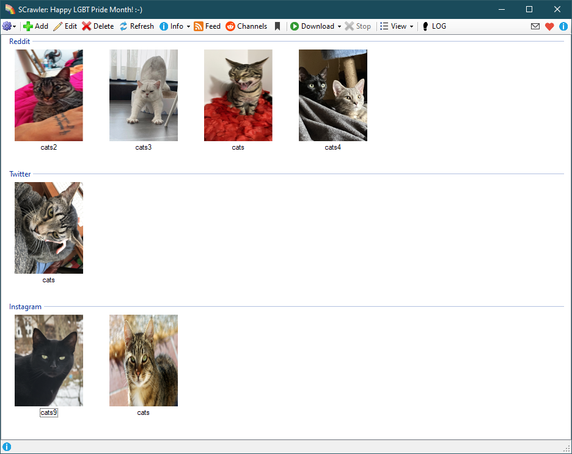
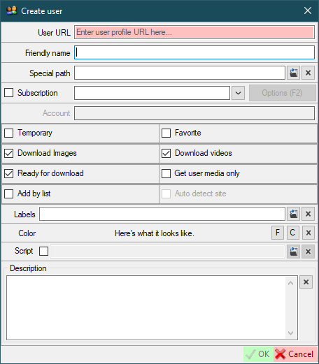

# :rainbow_flag: Social networks crawler :rainbow_flag:

[](https://github.com/AAndyProgram/SCrawler/releases/latest)
[](https://github.com/AAndyProgram/SCrawler/blob/main/LICENSE)
[](https://github.com/AAndyProgram/SCrawler/releases)
[](FAQ.md)
[](https://github.com/AAndyProgram/SCrawler/wiki)
[](HowToSupport.md)

A program to download photo and video from [any site](#supported-sites) (e.g. Reddit, Twitter, Instagram, TikTok, RedGifs, PornHub, XHamster, XVIDEOS, LPSG).

**If you like SCrawler, please like the program on [this site](https://alternativeto.net/software/scrawler/about/) and/or [this](https://www.softpedia.com/get/Internet/Download-Managers/Social-networks-crawler.shtml)**

Do you like this program? Consider adding to my coffee fund by making a donation to show your support. :blush:

[](https://ko-fi.com/andyprogram)

**Bitcoin**: BC1Q0NH839FT5TA44DD7L7RLR97XDQAG9V8D6N7XET




# What can program do:
- Download pictures and videos from users' profiles and subreddits:
  - Reddit images, galleries of images, videos, saved posts;
  - Redgifs videos (https://www.redgifs.com/);
  - Twitter images and videos, saved (bookmarked) posts;
  - Instagram images and videos, tagged posts, stories, saved posts;
  - TikTok videos ([limited](https://github.com/AAndyProgram/SCrawler/wiki/Settings#tiktok-limits));
  - Imgur images, galleries and videos;
  - Gfycat videos;
  - PornHub images, videos, save (liked) posts;
  - XHamster images, videos, saved posts;
  - XVIDEOS videos;
  - [Other](#supported-sites) supported sites
- Parse [channel and view data](https://github.com/AAndyProgram/SCrawler/wiki/Channels)
- Download [saved Reddit, Twitter and Instagram posts](https://github.com/AAndyProgram/SCrawler/wiki/Home#saved-posts)
- Add users from parsed channel
- **Advanced user management**
- **Automation** ([downloading data automatically](https://github.com/AAndyProgram/SCrawler/wiki/Settings#automation) every ```X``` minutes)
- **Feed** ([feed](https://github.com/AAndyProgram/SCrawler/wiki#feed) of downloaded media files)
- Labeling users
- Create [download groups](https://github.com/AAndyProgram/SCrawler/wiki/Settings#download-groups)
- Adding users to favorites and temporary
- [Filter exists users](https://github.com/AAndyProgram/SCrawler/wiki#view) by label or group
- Selection of media types you want to download (images only, videos only, both)
- [Download a special video](https://github.com/AAndyProgram/SCrawler/wiki#download-separate-video), image or gallery
- Making [collections](https://github.com/AAndyProgram/SCrawler/wiki#collections) (grouping users into collections)
- Specifying a user folder (for downloading data to another location)
- Changing user icons
- Changing [view modes](https://github.com/AAndyProgram/SCrawler/wiki#view)
- ...and many others...

# Supported sites

- **Reddit**
- **Twitter**
- **Instagram**
- **TikTok** ([limited](https://github.com/AAndyProgram/SCrawler/wiki/Settings#tiktok-limits))
- RedGifs
- Imgur
- Gfycat
- LPSG
- **PornHub**
- **XHamster**
- **XVIDEOS**
- [Other sites](Plugins.md)

**[SITES REQUIREMENTS](https://github.com/AAndyProgram/SCrawler/wiki/Settings#sites-requirements)**

# How it works

First, the program downloads the full profile. After the program downloads only new posts. The program remembers downloaded posts.

## Reddit

The program parses user posts, obtain MD5  images hash and compares them with existing ones to remove duplicates. Then the media will be downloaded.

## Other sites

The program parses user posts and compares file names with existing ones to remove duplicates. Then the media will be downloaded.

## How to request a new site

Read [here](CONTRIBUTING.md#how-to-request-a-new-site) about

# Requirements

- Windows 10, 11 with NET Framework 4.6.1 or higher (v4.6.1 must be installed). You can check version compatibility with this [tool](Tools/NET.FrameworkVersion.ps1).
- **[SITES REQUIREMENTS](https://github.com/AAndyProgram/SCrawler/wiki/Settings#sites-requirements)**

# Guide

- [Main window](https://github.com/AAndyProgram/SCrawler/wiki)
  - [Users](https://github.com/AAndyProgram/SCrawler/wiki/Users)
    - [Add/Edit/Delete users](https://github.com/AAndyProgram/SCrawler/wiki/Users)
    - [Collections](https://github.com/AAndyProgram/SCrawler/wiki#collections)
    - [User operations](https://github.com/AAndyProgram/SCrawler/wiki#context-menu)
    - [User labels](https://github.com/AAndyProgram/SCrawler/wiki/Users#labels)
  - **[DOWNLOAD](https://github.com/AAndyProgram/SCrawler/wiki#download)**
    - [Automation](https://github.com/AAndyProgram/SCrawler/wiki/Settings#automation)
    - [Download groups](https://github.com/AAndyProgram/SCrawler/wiki/Settings#download-groups)
  - [Downloading information](https://github.com/AAndyProgram/SCrawler/wiki#info)
  - [Reddit channels](https://github.com/AAndyProgram/SCrawler/wiki/Channels)
  - [Saved posts](https://github.com/AAndyProgram/SCrawler/wiki#saved-posts)
  - [View modes, filters](https://github.com/AAndyProgram/SCrawler/wiki#view)
- **[SETTINGS](https://github.com/AAndyProgram/SCrawler/wiki/Settings)**
  - **[SITES REQUIREMENTS](https://github.com/AAndyProgram/SCrawler/wiki/Settings#sites-requirements)**
  - [Reddit](https://github.com/AAndyProgram/SCrawler/wiki/Settings#reddit)
  - [Twitter](https://github.com/AAndyProgram/SCrawler/wiki/Settings#twitter)
  - [Instagram](https://github.com/AAndyProgram/SCrawler/wiki/Settings#instagram)
  - [TikTok](https://github.com/AAndyProgram/SCrawler/wiki/Settings#tiktok)
  - [RedGifs](https://github.com/AAndyProgram/SCrawler/wiki/Settings#redgifs)
  - [PornHub](https://github.com/AAndyProgram/SCrawler/wiki/Settings#pornhub)
  - [XHamster](https://github.com/AAndyProgram/SCrawler/wiki/Settings#xhamster)
  - [XVIDEOS](https://github.com/AAndyProgram/SCrawler/wiki/Settings#xvideos)
  - [LPSG](https://github.com/AAndyProgram/SCrawler/wiki/Settings#lpsg)

**Full guide you can find [here](https://github.com/AAndyProgram/SCrawler/wiki)**

# Installation

**Just download the [latest release](https://github.com/AAndyProgram/SCrawler/releases/latest), unzip the program archive to any folder and enjoy.** :blush:

**Don't put program in the ```Program Files``` system folder (this is portable program and program settings are stored in the program folder)**

# Updating

Just download [latest](https://github.com/AAndyProgram/SCrawler/releases/latest) version and unpack it into the program folder. **Before starting a new version, I recommend making a backup copy of the program settings folder.**

# [How to build from source](CONTRIBUTING.md#how-to-build-from-source)

# [How to make a plugin](https://github.com/AAndyProgram/SCrawler/wiki/Plugins)

# [How to support](HowToSupport.md)

# Settings and usage

The program has an intuitive interface.

**[SITES REQUIREMENTS](https://github.com/AAndyProgram/SCrawler/wiki/Settings#sites-requirements)**

Just add a user profile and **click the ```Download``` button**.

Read more about adding users and subreddits [here](https://github.com/AAndyProgram/SCrawler/wiki/Users)



# Using program as just video downloader

Create a shortcut for the program. Open shortcut properties. In the ```Shortcut``` tab, in the ```Target``` field, just add the letter ```v``` at the end across the space.

Example: ```D:\Programs\SCrawler\SCrawler.exe v```


# Contact me

[](https://matrix.to/#/@andyprogram:matrix.org)

[](https://discordapp.com/users/1012768226679206009) AndyProgram#3804